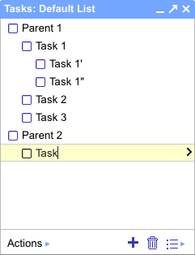

Title: Balancing Complexity
Description: I work with APIs daily at work. I work with APIs at night in my spare time. Perhaps this is because the term "API" or application program interface is too broad... It's a programmer's bread and butter.
Date: January 23, 2023

I work with APIs daily at work. I work with APIs at night in my spare time. Perhaps this is because the term "API" or application program interface is too broad... It's a programmer's bread and butter.

This week for a side project I was building with the Google Tasks API. This API was originally written a long time ago when google tasks looked like this:

Now the look of google tasks has changed over the past 10 years, but the back-end has stayed the same. This is valuable. Software that constantly changes creates more work for no reward. A todo list is relevant for all software engineers that started off making their first CRUD application with something similar. How does an enterprise, like Google, handle the simple to do list?

They keep it simple, stupid. You have requests to list the items, move the order, update or patch an item, and delete it. 

Yet there are still some weird peculiars. For example, to move to the end of a list, you have to get the id of the last item in the list, and call the move api with that id. The benefit to this, one could imagine, is that the user wants one item to come after another given item, and not to be the nth item of the list. 

If I have the list:

  1. Cheese
  2. Bacon
  3. Eggs

And I want to move Bacon to be after eggs while also adding Worcestershire sauce, then if the sauce if added to the 1st slot and I specified Bacon to be the 3rd, as before the sauce it is 2nd, then bacon remains in the same spot.

By contrast, the position value is a read-only reference where the only guarantee is that the positions are in ascending order. Therefore, you could get 0001, 0011, 0023, 9999 as potential order. This allows for sorting of a list without modifying every single item's position when you add one new value to the beginning.

The completion of the task is not a boolean. Instead it is a status string with the possible values of 'needsAction' and 'completed'. This allows for more states in the future. And there is also a field for a completedDate, which is not shown in the UI, but might be used to sort the completed items.

Google also provides a [discovery](https://www.googleapis.com/discovery/v1/apis/tasks/v1/rest) JSON response showing all the capabilities of the API without a pesky UI. Straight to the point. There's a description of what each field does and the scopes required.

We can compare this to one of Google's competitors, Amazon, perhaps the [inventor](https://nordicapis.com/the-bezos-api-mandate-amazons-manifesto-for-externalization/) of the way most programmers experience APIs today.

I decided to upload my python tool as a AWS lambda to be run nightly by a EventBridge cron job. Uploading lambdas directly to AWS can be dreadful. A [whole company](https://www.serverless.com/) was created to make the job easier. Following Amazon's [example documentation](https://docs.aws.amazon.com/lambda/latest/dg/python-package.html#python-package-dependencies), I could not figure out how to get third party dependencies to work within the lambda. I ended up creating a lambda layer and after zipping that properly, I have it functioning after 3 hours.

Don't get me wrong, lambdas are wonderful, that's why I use them. Yet the API definition was likely not as clearly defined as it needed to be.

Working with the Google Tasks API provides more insight into how Google approached API design and an overall appreciation for great API design. Overtime more features have been added. Yet, 10 years later, it still works. Which is more than I can ask for other Google products.