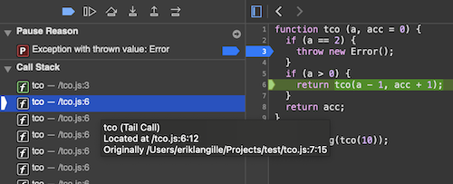

Title: Proper Tail Calls: The unimplemented web standard from ES6
Description: Chrome and Firefox are not compliant with the ES6 web standard from 2015. How could this be, over eight years later? Is it some nuanced optimization or a crucial feature? Well - it's both.
Date: 2024-01-05

Chrome and Firefox are not compliant with the [ES6 web standard](https://262.ecma-international.org/6.0/) from 2015. How could this be, over eight years later? Is it some nuanced optimization or a crucial feature? Well - it's both.

The standard missing in two of the three major browsers is tail call optimization (or proper tail calls, I will use the terms interchangeably). Here's a simple example of a recursive method that would benefit from proper tail calls: 

    :::JavaScript
    function tco (a, accumulator = 0) {
      if (a > 0) {
        return tco(a - 1, accumulator + 1);
      }
      return accumulator;
    }

    console.log(tco(10)); // Outputs 10. Yes, this is a simple example

For every recursive call to the `tco` function, we have to initialize a new stack. A stack contains all variables local to the function call in memory. The stack cannot be cleared and the variables removed from memory until the function return. In our example, for very large values of a, this will cause a stack overflow as we run out of memory from recursively calling the function.

Tail call optimization solves this by instead of the initializing a new stack, the same stack is reused with the new variables from the recursive function call.

This means that in the recursive call, there cannot be any operations applied to the method. For e.g.

    :::JavaScript
    return tco(a - 1, accumulator + 1) * 2;

would break the tail call optimization.

Although at first glance this change looks like a simple optimization, what we're really dealing with is spiritual warfare.

To exemplify the problems with tail call optimization, let's modify this method to throw an error, so we can see the stack trace:

    :::JavaScript
    function tco (a, accumulator = 0) {
      if (a == 2) {
        throw new Error();
      }
      if (a > 0) {
        return tco(a - 1, accumulator + 1);
      }
      return accumulator;
    }

    console.log(tco(10))

When we call this function with [Node.js](https://nodejs.org/en), which uses Chrome's [V8](https://v8.dev/) JavaScript engine, it gives us the following stack trace:

    :::Bash
    ➜  test node tco.js

    Error
        at tco (/Users/eriklangille/Projects/test/tco.js:3:11)
        at tco (/Users/eriklangille/Projects/test/tco.js:6:12)
        at tco (/Users/eriklangille/Projects/test/tco.js:6:12)
        at tco (/Users/eriklangille/Projects/test/tco.js:6:12)
        at tco (/Users/eriklangille/Projects/test/tco.js:6:12)
        at tco (/Users/eriklangille/Projects/test/tco.js:6:12)
        at tco (/Users/eriklangille/Projects/test/tco.js:6:12)
        at tco (/Users/eriklangille/Projects/test/tco.js:6:12)
        at tco (/Users/eriklangille/Projects/test/tco.js:6:12)
        at Object.<anonymous> (/Users/eriklangille/Projects/test/tco.js:12:13)

We can then run the same function with [Bun](https://bun.sh), which uses Safari's [JavaScriptCore](https://docs.webkit.org/Deep%20Dive/JSC/JavaScriptCore.html) JavaScript engine:

    :::Bash
    ➜  test bun tco.js
    1 | function tco (a, acc = 0) {
    2 |   if (a == 2) {
    3 |     throw new Error();
                  ^
    error: Error
          at tco (/Users/eriklangille/Projects/test/tco.js:3:11)
          at /Users/eriklangille/Projects/test/tco.js:12:13

Bun's stack trace is more readable, but it has fewer frames in the stack trace, because they have been optimized away. [Critics](https://neopythonic.blogspot.com/2009/04/tail-recursion-elimination.html) of tail call optimization declare this one of the major flaws.

Guido von Rossum, creator of the Python language, also adds that tail call *optimization* is a feature, not an optimization. It enables new code variations that could otherwise be implemented iteratively. The example given above could be written using a for loop without requiring tail call optimization:

    :::JavaScript
    function notTco(a, accumulator) {
      for (accumulator = 0; accumulator < a; accumulator++) {
      }
      return accumulator;
    }

    console.log(notTco(10)) // Also outputs 10

Therefore, tail call optimization can be viewed as a stylistic choice. And one that [Guido argues is not Pythonic](http://neopythonic.blogspot.com/2009/04/final-words-on-tail-calls.html).

But JavaScript is not Python. JavaScript has adopted a lot of the functional languages paradigms, such as closures and chaining higher order functions. In addition, if we wanted to squeeze the last bit of performance out of our applications, shouldn't we be implementing every optimization?

It was likely in this spirit why proper tail calls was [adopted as part of the ES6 standard](https://262.ecma-international.org/6.0/#sec-tail-position-calls). That means, in order for a browser to properly comply with ES6, it *has* to implement proper tail calls.

Safari's JavaScriptCore is the have your cake and eat it too solution. And it's the only major browser to implement tail call optimization as specified. Referring back to the Bun console output, we can observe the arguably confusing stack trace. But the story changes when we [open the debugger](https://bun.sh/docs/runtime/debugger#inspect-brk) and pause on exceptions:

Wait. How can there be a full stack trace if the stack calls have been optimized away?

That's because the developers (or [one in particular](https://bugs.webkit.org/show_bug.cgi?id=155598)) at Apple working on JavaScriptCore were aware of the debugging criticism when dealing with tail call optimization, and went a step further to address the critics.

JavaScriptCore [implements a Shadow stack](https://github.com/WebKit/WebKit/commit/da35b6e20587e0a94a8ac795e69bd5491b4b1af4) to keep track of tail call optimization calls. Their JavaScript virtual machine implements special bytecode intructions to keep track of tail call deleted frames. Then they have an [algorithm](https://webkit.org/blog/6240/ecmascript-6-proper-tail-calls-in-webkit/) called `ShadowChicken` in their VM that reconciles these commands to track variables and calls for each of these deleted frames. The deleted frame tracking algorithm adds a 6% overhead, so it is only enabled by default when the debugger is open.

So if the engineers at Apple could figure it out, why didn't Google implement proper tail call optimization in Chrome? Skill issue:

> "[The belief that proper tail call makes code run faster] is validated by the JSC team's implementation which shows some performance wins in some cases. However, this belief is invalidated by the v8 team which sees it as mostly performance neutral, and the Chakra team which, due to other constraints, may not be able to implement the feature without regressing performance of existing code that happens to include tail calls or sacrificing spec conformance."

From the [Google PTC amendment proposal](https://github.com/tc39/proposal-ptc-syntax)

To be fair to Google, when the specification was accepted the precise challenges in implementing tail call optimization were not clear. The chromium team [did start their implementation](https://bugs.chromium.org/p/v8/issues/detail?id=4698), before they ran into some edge cases that were giving improper behaviour. They also did the smart engineering thing when dealing with these edges cases: instead of spending hours debugging code, they suggested a new standard that would simplify the implementation. This change would have made tail call optimization explicitly opt-in by using the `continue` keyword. My code example would now look like this:

    :::JavaScript
    function tco (a, accumulator = 0) {
      if (a > 0) {
        return continue tco(a - 1, accumulator + 1);
      }
      return accumulator;
    }

I personally would have been satisfied with this adjustment, because then the standard would've been adopted. Unfortunately, for reasons unknown to me, this amendment was rejected. Perhaps it was the same spiritual force that makes this topic so controversial in the first place. Feel free to read the whole proposal [here](https://github.com/tc39/proposal-ptc-syntax).

So where does this leave us? Well, the web is still fractured, with Safari and Chrome giving different stack traces for functions that can be optimized with tail call optimization. In addition, developers cannot use this paradigm on the web, as only one of the major browsers supports it. 

Perhaps with [Bun](https://bun.sh)'s choice of using Safari's JavaScriptCore engine, we will see a revival in functions written with proper tail calls. And the spiritual war can be reignited for many years to come.
